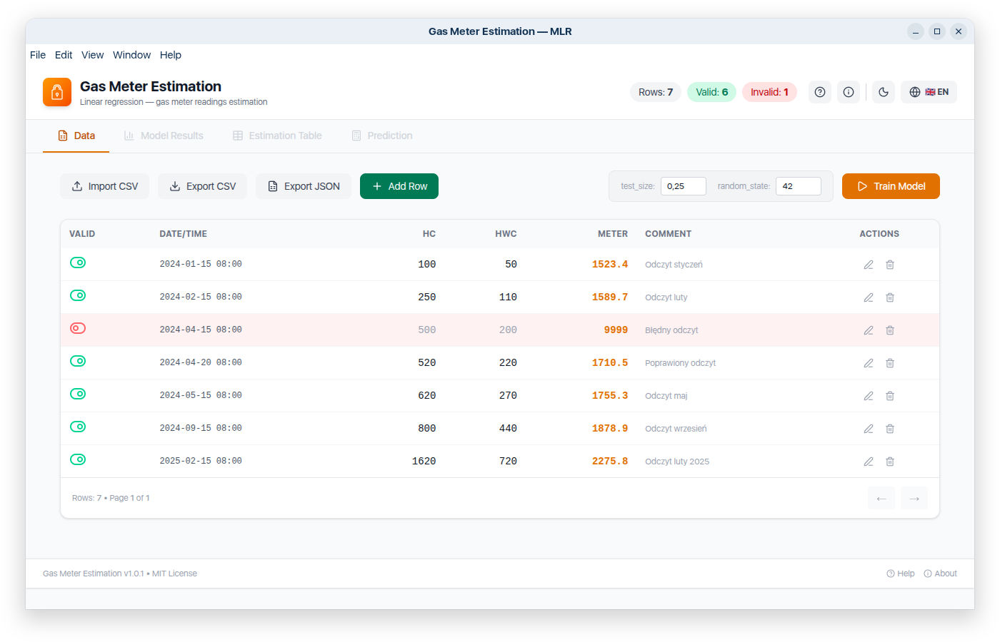
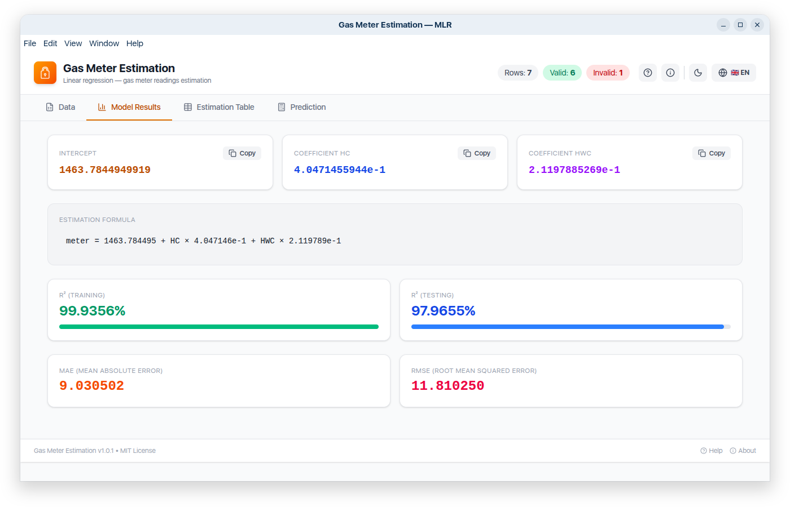
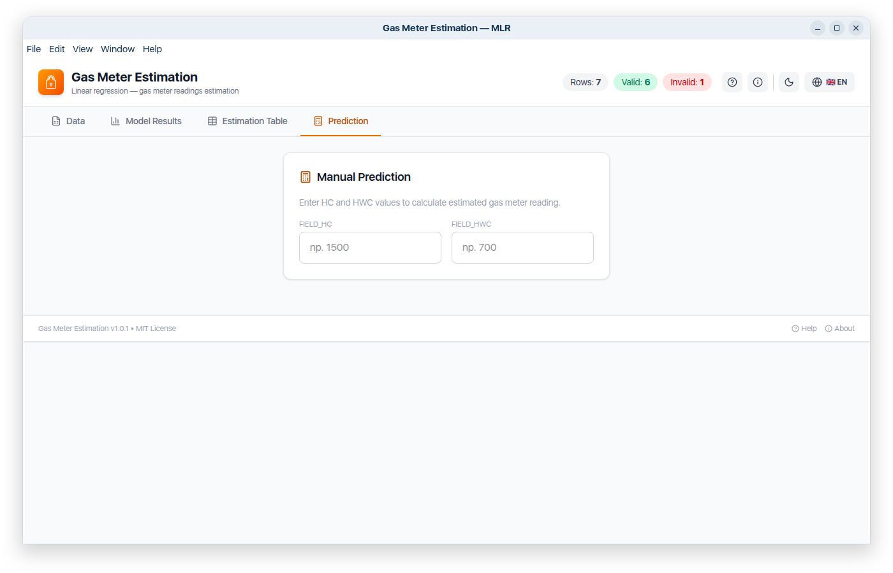

# ⛽ Gas Meter Estimation — MLR

[](https://opensource.org/licenses/MIT)
[](https://python.org)
[](https://reactjs.org)

**🇬🇧 [English version below](#english-version)**

---

## 🇵🇱 Wersja polska

### Opis

Aplikacja do szacowania odczytów gazomierza przy użyciu **Multiple Linear Regression (MLR)**. Pozwala wczytać dane z pliku CSV, wytrenować model regresji liniowej i porównać odczyty rzeczywiste z szacowanymi.

Inspirowana Skryptem Python autorstwa [andr2000](https://github.com/andr2000/ufh-controller/blob/872a2783040d9da02c5a526eea54a5c14f791468/gas_meter/meter_readings.py) i artykulem [techniczny.wordpress.com](https://techniczny.wordpress.com/2018/04/08/pomiar-zuzycia-gazu-przez-raspberry-pi-i-ebus/) oraz przewodnikiem MLR [Bee Guan Teo](https://medium.com/ds-notes/multiple-linear-regression-with-scikit-learn-a-quickstart-guide-41a310bd8414).

### Funkcje

| Funkcja | Opis |
|---------|------|
| 📂 **Import/Export CSV** | Wczytywanie i zapisywanie danych w formacie CSV |
| 📋 **Export JSON** | Eksport danych do formatu JSON |
| ➕ **Dodawanie wierszy** | Formularz do dodawania nowych odczytów |
| ✏️ **Edycja wierszy** | Edycja istniejących danych inline |
| 🗑️ **Usuwanie wierszy** | Usuwanie z potwierdzeniem |
| 🔄 **Toggle Valid (0/1)** | Wiersze z Valid=0 nie są brane pod uwagę w modelu |
| 🚀 **Trenowanie modelu** | Regresja liniowa z konfigurowalnymi parametrami (test_size, random_state) |
| 📊 **Wyniki modelu** | Intercept, współczynniki HC/HWC, R² (Training/Testing), MAE, RMSE |
| 📋 **Tabela estymacji** | Porównanie odczytów rzeczywistych z szacowanymi (błędy kolorowane: 🟢 < 1, 🟡 < 5, 🔴 ≥ 5) |
| 🧮 **Predykcja** | Ręczne wprowadzanie HC i HWC — obliczanie estymowanego odczytu |
| 📋 **Kopiowanie współczynników** | Przyciski Copy przy Intercept, HC, HWC z pełną precyzją |
| ☀️🌙 **Motyw jasny/ciemny** | Przełącznik z zapamiętywaniem |
| 🇵🇱🇬🇧 **Język PL/EN** | Przełącznik z zapamiętywaniem |
| 🕐 **Ostatnie dane** | Automatyczne zapamiętywanie i szybkie wczytanie danych z poprzedniej sesji |
| 🖥️ **Aplikacja desktopowa i WEB** | Windows, Linux lub przez przeglądarkę

## 📸 Zrzuty ekranu

| Widok danych | Wyniki modelu | Predykcja |
|--------------|---------------|-----------|
|  |  |  |

## 🛠️ Instalacja

### Wymagania
- Node.js 18+
- npm lub yarn

### Kroki instalacji

```bash
# Sklonuj repozytorium
git clone https://github.com/marcin77/gas-meter-estimation.git
cd gas-meter-estimation

# Zainstaluj zależności
npm install
npm run build
```

## Sposoby uruchomienia

# 1. Przeglądarka (najprostsze)
```bash
# Automatycznie otworzy przeglądarkę na http://localhost:8080.
python3 run_web.py
# lub
xdg-open dist/index.html
```
lub dwukrotnie kliknij plik dist/index.html w menedżerze plików

```
# Tryb dev Otworzy się na http://localhost:5173
npm run dev
```

# 2. Aplikacja desktopowa
```
npm run dist:linux    # dla Linux (AppImage)
npm run dist:win      # dla Windows (.exe)
npm run dist:mac      # dla macOS (.dmg)
```
**AppImage (Linux)**

Pobierz z Releases plik .AppImage:

**EXE (Windows)**

Pobierz z Releases plik .exe i uruchom.

**dmg (Apple)**

Pobierz z Releases plik .dmg i uruchom.

**Electron**
```
npm run electron
```

### Wymagany format CSV

```csv
FIELD_VALID,FIELD_DATETIME,FIELD_HC,FIELD_HWC,FIELD_METER,FIELD_COMMENT
1,2024-01-15 08:00:00,100,50,1523.400,Odczyt styczeń
1,2024-02-15 08:00:00,250,110,1589.700,Odczyt luty
0,2024-03-15 08:00:00,300,130,9999.000,Błędny odczyt
```
| Kolumna | Typ | Opis |
|---------|-----|------|
| `FIELD_VALID` | `0/1` | Czy wiersz jest prawidłowy (1=tak, 0=nie) |
| `FIELD_DATETIME` | `tekst` | Data i czas odczytu |
| `FIELD_HC` | `liczba` | Heat Counter — licznik ciepła |
| `FIELD_HWC` | `liczba` | Hot Water Counter — licznik ciepłej wody |
| `FIELD_METER` | `liczba` | Odczyt gazomierza |
| `FIELD_COMMENT` | `tekst` | Komentarz (opcjonalny) |

## english version

## soon

# Example headings

## Sample Section

## This'll be a _Helpful_ Section About the Greek Letter Θ!
A heading containing characters not allowed in fragments, UTF-8 characters, two consecutive spaces between the first and second words, and formatting.

## This heading is not unique in the file

TEXT 1

## This heading is not unique in the file

TEXT 2

# Links to the example headings above

Link to the sample section: [Link Text](#sample-section).

Link to the helpful section: [Link Text](#thisll-be-a-helpful-section-about-the-greek-letter-Θ).

Link to the first non-unique section: [Link Text](#this-heading-is-not-unique-in-the-file).

Link to the second non-unique section: [Link Text](#this-heading-is-not-unique-in-the-file-1).
### Autorzy / Źródła
+ **marcin77** — GUI / aplikacja webowa
+ **andr2000** — oryginalny skrypt Python
+ **techniczny** — pomiar zużycia gazu przez Raspberry Pi
+ **Bee Guan Teo** — przewodnik MLR
